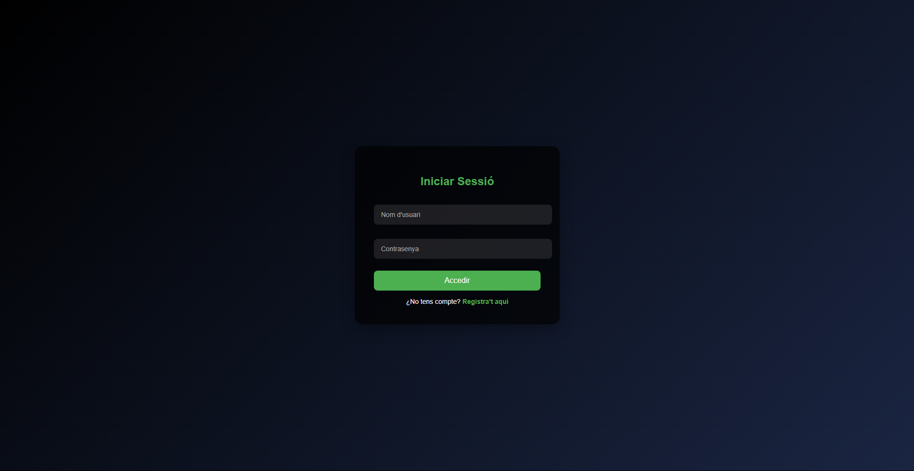
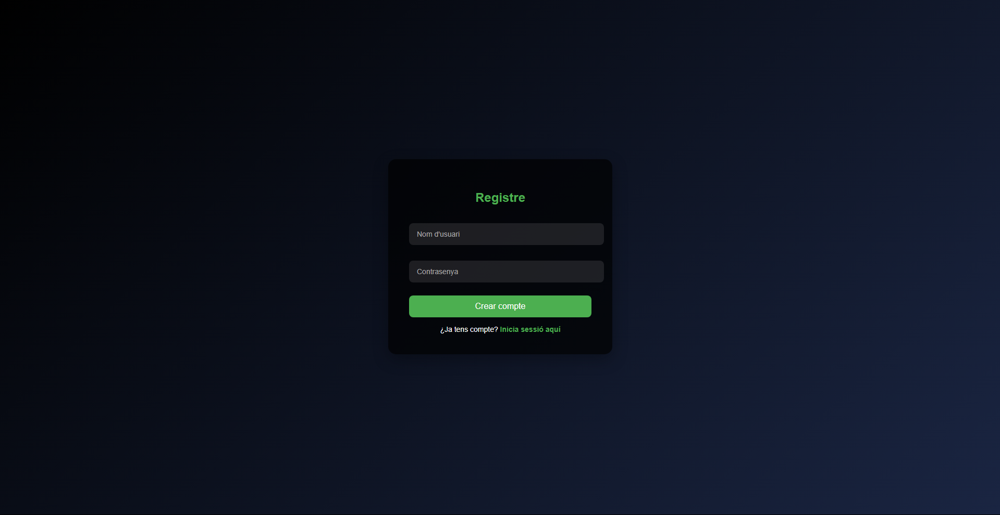
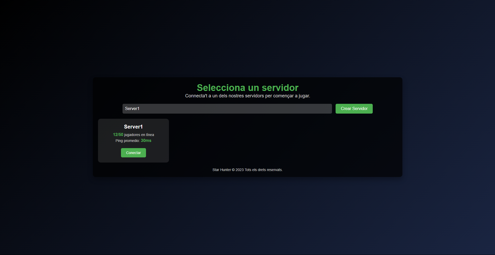
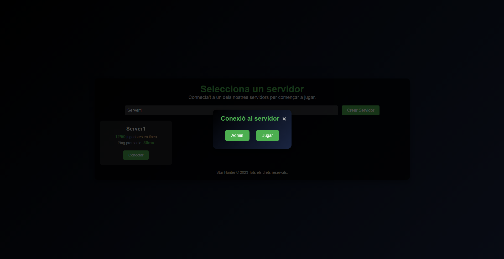
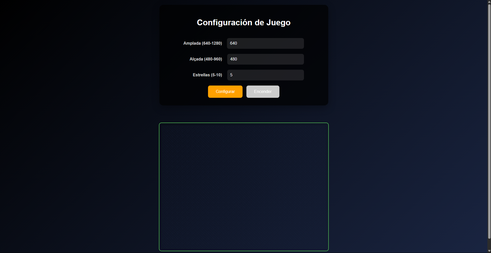
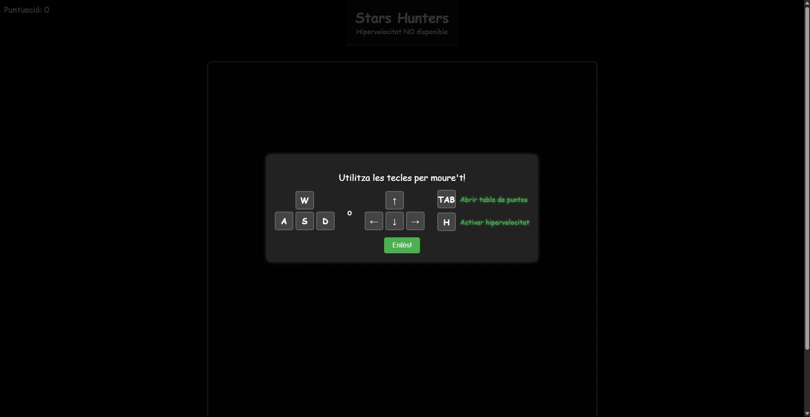
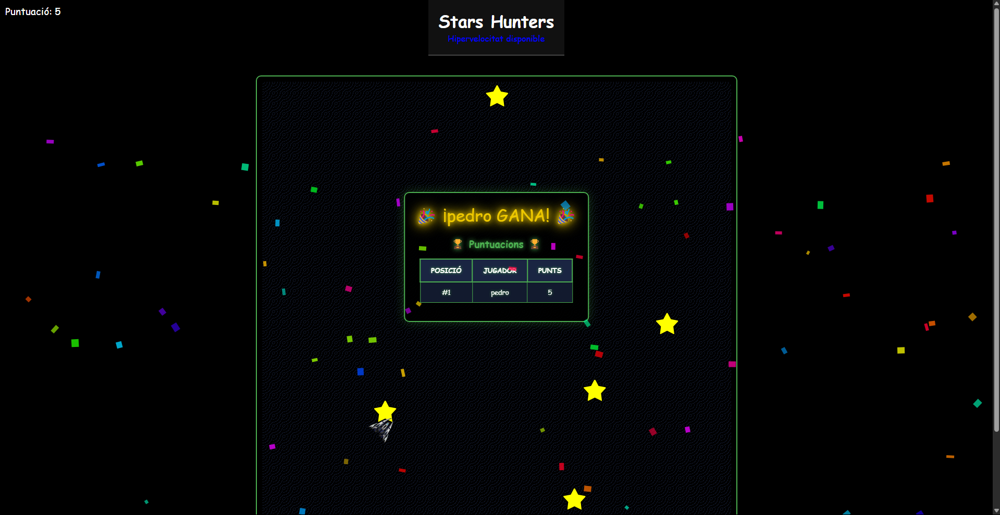

<h1 align="center">🌟 Stars Hunter</h1>
<h3 align="center">🎮 Juego multijugador de capturar de estrellas</h3>

<p align="center">
  <em>¡Compite por capturar todas las estrellas en el mapa y conviértete en el ganador estelar!</em>
</p>

---

## 🚀 Clonación e instalación

Para comenzar a trabajar con este proyecto, sigue los siguientes pasos:

1. **Clona el repositorio**:
   Abre una terminal y ejecuta el siguiente comando:
  ```Bash
   git clone https://github.com/Christian270304/Stars-Hunters.git
  ```

2. **Instala las dependencias**:
   Navega al directorio del proyecto y ejecuta el siguiente comando para instalar las dependencias:
  ```Bash
    cd stars-hunter 
    npm install
  ```

3. **Inicia el servidor**:
   Una vez que las dependencias estén instaladas, ejecuta el siguiente comando para iniciar el servidor:
  ```Bash
   npm start
  ```
   Esto iniciará el servidor en el puerto por defecto (`3000`), o en el puerto que hayas configurado.

---

<h2>🚀 ¿Cómo funciona?</h2>
<p align="justify">
  El juego se desarrolla en un mapa con dimensiones configurables, donde las estrellas aparecen aleatoriamente. Los jugadores deben moverse por el mapa para atraparlas antes que los demás. Al entrar por primera vez en la sala, se muestran los controles del juego para que los jugadores sepan cómo interactuar. El primer jugador que capture la cantidad de estrellas configurada por el administrador será el ganador.
</p>

---

<h2>🧑‍💻 Roles en el juego</h2>
<h3>👑 Admin</h3>
<ul>
  <li>Define el ancho y alto del mapa</li>
  <li>Establece la cantidad total de estrellas</li>
  <li>Inicia y reinicia la partida</li>
</ul>

<h3>🕹 Jugador</h3>
<ul>
  <li>Se desplaza por el mapa</li>
  <li>Captura las estrellas disponibles</li>
  <li>Gana quien atrape todas las estrellas asignadas</li>
</ul>

---

<h2>🏆 Ganador</h2>
<p>
  Cuando un jugador alcanza el número total de estrellas necesarias, aparece un mensaje anunciando su victoria con su nombre destacado.
</p>

---

<h2>🖼️ Imágenes del juego</h2>
<p>A continuación, se incluyen capturas del juego:</p>

<p align="center">
  
</p> 
<p align="center">
  
</p>
<p align="center">
  
</p>
<p align="center">
  
</p>
<p align="center">
  
</p>
<p align="center">
  
</p>
<p align="center">
  
</p>

---

## 🛠️ Tecnologías utilizadas

Este proyecto fue desarrollado utilizando las siguientes tecnologías:

- **Node.js**: Un entorno de ejecución para JavaScript en el servidor, utilizado para construir la lógica del juego y gestionar las conexiones.
- **Express**: Un framework de Node.js para gestionar las rutas HTTP de manera sencilla y eficiente.
- **Socket.IO**: Una librería para habilitar la comunicación en tiempo real entre el servidor y los clientes, permitiendo la actualización instantánea del estado del juego.
- **HTML/CSS/JavaScript**: Para la interfaz de usuario y la lógica del lado del cliente.
- **JavaScript**: Se utiliza tanto en el frontend como en el backend para lograr una experiencia de desarrollo homogénea.

---
 
